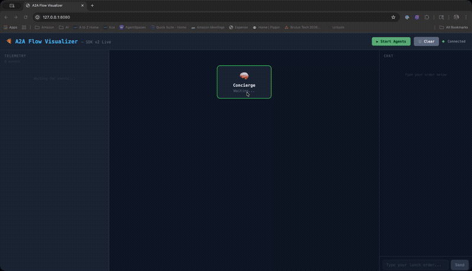

# 🍕 A2A Lunch Concierge

A teaching-focused demo of the **[Agent-to-Agent (A2A) protocol](https://a2a-protocol.org/latest/specification/)** using the official `a2a-sdk` v1.0.2.

Four food-ordering agents demonstrate the three core A2A communication patterns — **instant**, **streaming (SSE)**, and **long-running (polling)** — orchestrated by an LLM-powered Concierge that discovers agents at runtime.



| Agent | Port | Pattern | Capability |
|---|---|---|---|
| 🍕 Pizza Seller | 9001 | Instant (blocking) | `streaming: false` |
| 🍔 Burger Seller | 9002 | Instant (blocking) | `streaming: false` |
| 🍝 Pasta Seller | 9004 | **Streaming (SSE)** | `streaming: true` |
| 🍽️ Catering Planner | 9003 | Long-running (polling) | `streaming: false`, 2 skills |

## Quick Start

### Requirements

- Python 3.10+ (tested with 3.13)
- AWS credentials configured for [Amazon Bedrock](https://aws.amazon.com/bedrock/) access (for the LLM-powered chat mode)

### Setup

```bash
python3 -m venv .venv
source .venv/bin/activate
pip install -r requirements.txt
```

**Note:** Requires `protobuf>=4.25,<7` (v7+ has compatibility issues with the SDK).

### Run

```bash
# Deterministic demo (no LLM needed)
python -m a2a_sdk_demo.run_all

# LLM-powered interactive chat (needs AWS Bedrock)
python -m a2a_sdk_demo.chat
```

### With Live Dashboard

**Terminal 1** — Start the dashboard:
```bash
python -m a2a_sdk_demo.dashboard.dashboard_server
# → Opens http://127.0.0.1:8080 in browser
```

**Terminal 2** — Start the chat:
```bash
python -m a2a_sdk_demo.chat
# → Type orders here, dashboard animates in real-time
```

## Learning Path

New to A2A? Read the code in this order:

| Step | File | What You'll Learn |
|------|------|-------------------|
| 1 | [`server/agent_server.py`](a2a_sdk_demo/server/agent_server.py) (lines 46–116) | What an Agent Card looks like — skills, tags, capabilities |
| 2 | [`server/executors/pizza_executor.py`](a2a_sdk_demo/server/executors/pizza_executor.py) | The simplest possible agent — receive message, reply instantly |
| 3 | [`client/sdk_client.py`](a2a_sdk_demo/client/sdk_client.py) (lines 46–69) | How clients discover agents via `GET /.well-known/agent-card.json` |
| 4 | [`client/sdk_client.py`](a2a_sdk_demo/client/sdk_client.py) (lines 120–161) | How to send a message via JSON-RPC `SendMessage` |
| 5 | [`server/executors/pasta_executor.py`](a2a_sdk_demo/server/executors/pasta_executor.py) | Streaming pattern — word-by-word SSE responses |
| 6 | [`server/executors/catering_executor.py`](a2a_sdk_demo/server/executors/catering_executor.py) | Long-running tasks — progress updates + polling |
| 7 | [`run_all.py`](a2a_sdk_demo/run_all.py) | See it all come together — start agents, discover, delegate |

> **Tip:** Run `python -m a2a_sdk_demo.run_all` first, then trace the code path from `run_all.py` → `sdk_client.py` → `agent_server.py` → executor.

## Architecture

```
User request
   │
   ▼
🧠 Concierge (LLM-powered orchestrator)
   │
   ├── GET  /.well-known/agent-card.json   ← Discovery (all agents)
   │
   ├── JSON-RPC SendMessage                ← Pizza/Burger (instant)
   ├── REST POST /message:stream (SSE)     ← Pasta (streaming)
   └── JSON-RPC SendMessage + GetTask poll ← Catering (long-running)
   │
   ▼
Combined lunch order summary
```

## File Structure

```
a2a_sdk_demo/
├── __init__.py               Package overview
├── chat.py                   Terminal UI + orchestration (emits events to dashboard)
├── run_all.py                Deterministic demo entry point
│
├── server/                   ← Agent servers (SDK-wired)
│   ├── agent_server.py           FastAPI app with SDK route wiring
│   └── executors/
│       ├── pizza_executor.py     AgentExecutor for pizza (instant)
│       ├── burger_executor.py    AgentExecutor for burger (instant)
│       ├── pasta_executor.py     AgentExecutor for pasta (streaming SSE)
│       └── catering_executor.py  AgentExecutor for catering (long-running)
│
├── client/                   ← A2A protocol + LLM
│   ├── sdk_client.py             A2A v1.0 helpers (discover, send, poll)
│   └── llm_planner.py            Bedrock LLM planning
│
└── dashboard/                ← Live visualization
    ├── event_bus.py              SSE server + POST /emit receiver
    ├── dashboard_server.py       Standalone launcher
    └── dashboard.html            Animated browser UI

```

## A2A Concepts Demonstrated

| Concept | Where to look |
|---|---|
| Agent Card discovery | `server/agent_server.py` → `build_agent_card()` |
| Skills & tags | `server/agent_server.py` → `AGENT_CONFIGS` |
| JSON-RPC transport | SDK `create_jsonrpc_routes()` in `agent_server.py` |
| Message parts | `a2a.types.a2a_pb2.Message`, `Part` |
| Task lifecycle | `executors/catering_executor.py` + SDK `InMemoryTaskStore` |
| Streaming (SSE) | `executors/pasta_executor.py` + `/message:stream` endpoint |
| LLM-powered orchestration | `client/llm_planner.py` (Bedrock) |

## Key SDK Patterns

### Server: `AgentExecutor`

```python
class PizzaExecutor(AgentExecutor):
    async def execute(self, context: RequestContext, event_queue: EventQueue) -> None:
        user_text = extract_text(context.message)
        reply = process_order(user_text)
        await event_queue.enqueue_event(
            Message(role=ROLE_AGENT, parts=[Part(text=reply)])
        )
```

### Client: A2A v1.0 Protocol

```python
headers = {"A2A-Version": "1.0"}
payload = {
    "jsonrpc": "2.0", "id": "req-1", "method": "SendMessage",
    "params": {"message": {"role": 1, "message_id": "uuid", "parts": [{"text": "..."}]}}
}
```

### Long-Running Tasks

```python
# Step 1: SendMessage with return_immediately
params = {"message": {...}, "configuration": {"return_immediately": True}}
# → Returns task with state="WORKING"

# Step 2: Poll with GetTask
payload = {"method": "GetTask", "params": {"id": task_id}}
# → Returns progress updates until state="COMPLETED"
```

## Configuration

Before running the LLM-powered chat, create a `.env` file:

```bash
cp .env.example .env
```

| Environment Variable | Required | Description |
|---|---|---|
| `AWS_REGION` | ✅ | AWS region for Bedrock (e.g. `us-east-1`) |
| `BEDROCK_MODEL` | ✅ | Model ID (e.g. `anthropic.claude-3-haiku-20240307-v1:0`) |

AWS credentials are resolved via the standard boto3 chain (AWS CLI profiles, env vars, IAM roles). See [`.env.example`](.env.example) for full details.

> **Note:** The deterministic demo (`run_all`) does not require Bedrock — only the interactive `chat` mode does.

## SDK Gotchas

| Issue | Solution |
|---|---|
| `enqueue_event` is async | Must `await event_queue.enqueue_event(...)` |
| No `A2A-Version` header → v0.3 assumed | Add `A2A-Version: 1.0` header |
| `protobuf>=7` breaks SDK | Pin `protobuf>=4.25,<6` |
| SDK `/{tenant}` catch-all route | Register custom routes BEFORE SDK routes |

## References

- [A2A specification](https://a2a-protocol.org/latest/specification/)
- [A2A v1.0 announcement](https://a2a-protocol.org/latest/announcing-1.0/)
- [A2A Python SDK](https://github.com/a2aproject/a2a-python)
- [A2A SDK Python docs](https://a2a-protocol.org/latest/sdk/python/)

## License

Apache-2.0 — see [LICENSE](LICENSE).
